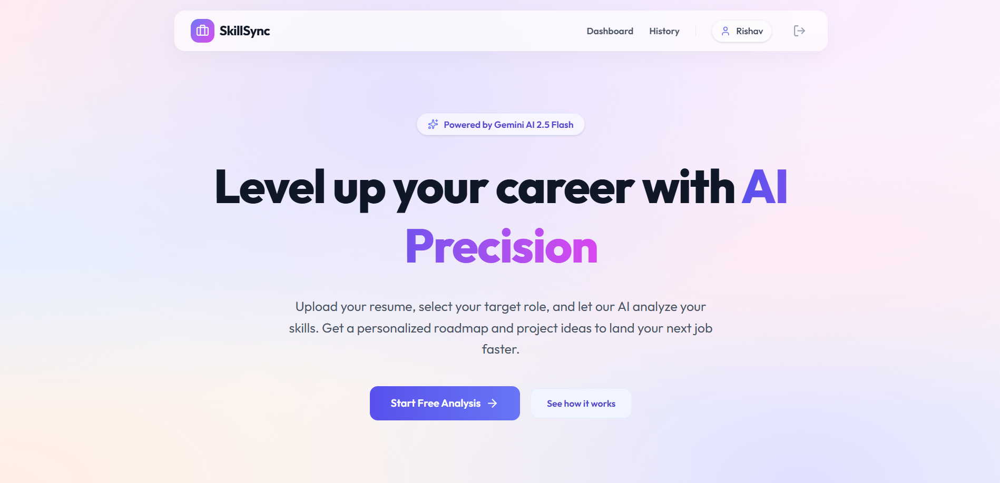

# 🚀 AI-Based Job Skill Gap Analyzer

<p align="center">
  
</p>

<p align="center">
  <b>AI-powered MERN application that analyzes resumes, detects skill gaps, and generates personalized career roadmaps using Gemini API.</b>
</p>

<p align="center">
  ⚡ MERN Stack • 🤖 Gemini AI • 📊 Skill Analysis • 🧭 Career Roadmaps
</p>

---

## ✨ Overview

**SkillSync** is a full-stack AI career intelligence platform that helps users understand their skill level compared to industry job roles.

It analyzes resumes using AI and provides:
- Missing skills
- Skill gap percentage
- Learning roadmap
- Project suggestions

---

## 🚀 Features

- 🔐 Secure authentication (JWT)
- 📄 Resume upload (PDF + manual input)
- 🤖 AI-powered analysis using Gemini API
- 📊 Skill gap detection system
- 🧭 Personalized learning roadmap
- 💡 Real-world project recommendations
- 🕓 User analysis history dashboard
- 📱 Fully responsive UI (mobile + desktop)

---

## 🧠 AI Engine

SkillSync uses **Google Gemini AI** to:
- Extract skills from resumes
- Match against job roles
- Identify missing skills
- Generate structured career roadmap
- Suggest improvement projects

---

## 🛠️ Tech Stack

**Frontend**
- React.js
- Tailwind CSS
- Context API

**Backend**
- Node.js
- Express.js
- MongoDB
- JWT Authentication

**AI Integration**
- Google Gemini API

**Tools**
- Vercel
- Render / Railway
- Git & GitHub

---

## 📁 Project Structure

```bash id="w8m2qv"
SkillSync/
│
├── client/        # React Frontend
│   ├── src/
│   ├── pages/
│   ├── components/
│
├── server/        # Node Backend
│   ├── routes/
│   ├── controllers/
│   ├── models/
│
└── README.md
